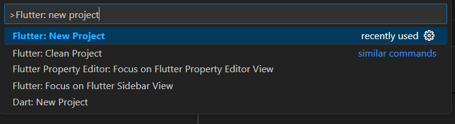
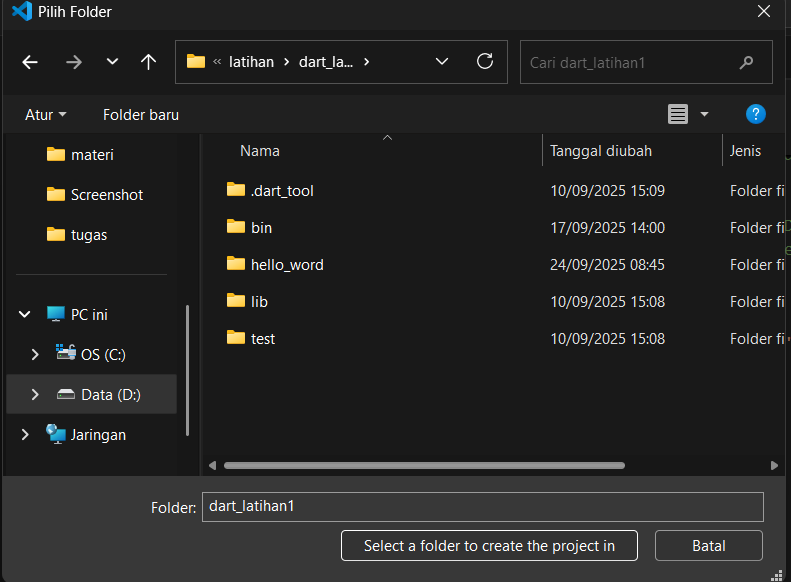
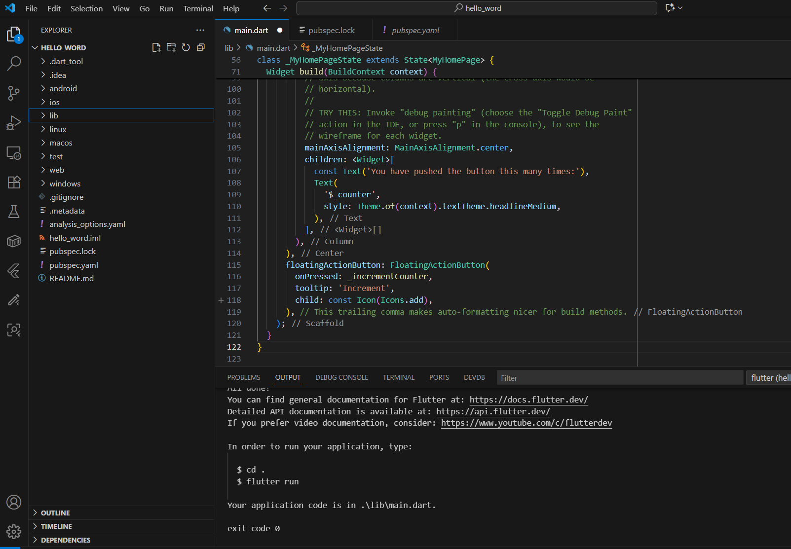

# hello_word

A new Flutter project.

# Laporan Praktikum Flutter Fundamental

**Nama:** Ismi Atika  
**NIM:** 2341760036  
**Kelas:** SIB3C  

---

## Praktikum 1: Membuat Project Flutter Baru

Membuat folder dengan menggunakan flutter:new project dan pilih aplication untuk masuk ke folder.

Memilih folder untuk penyimpanan hasil pengerjaan.

Membuat nama project flutter dengan nama hello_word.

Jika sudah selesai proses pembuatan project baru, pastikan tampilan seperti berikut. Pesan akan tampil berupa "Your Flutter Project is ready!" artinya Anda telah berhasil membuat project Flutter baru.

