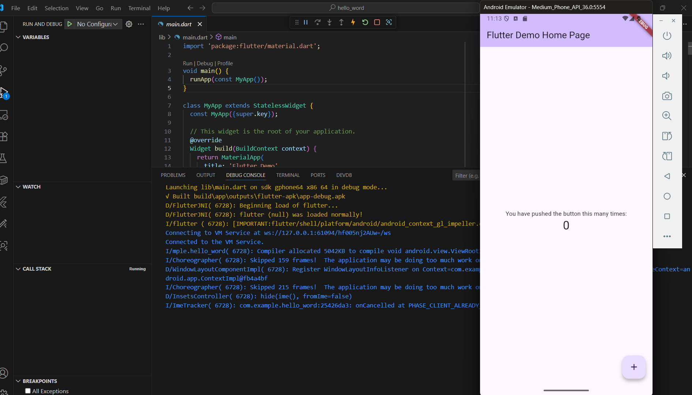

# hello_word

A new Flutter project.

# Laporan Praktikum Flutter Fundamental

**Nama:** Ismi Atika  
**NIM:** 2341760036  
**Kelas:** SIB3C  

---

## Praktikum 1: Membuat Project Flutter Baru

Membuat folder dengan menggunakan flutter:new project dan pilih aplication untuk masuk ke folder.

Memilih folder untuk penyimpanan hasil pengerjaan.

Membuat nama project flutter dengan nama hello_word.

Jika sudah selesai proses pembuatan project baru, pastikan tampilan seperti berikut. Pesan akan tampil berupa "Your Flutter Project is ready!" artinya Anda telah berhasil membuat project Flutter baru.

Kesimpulan: melakukan pembuatan project Flutter baru dengan nama hello_world untuk memahami struktur dasar project

## Praktikum 2: Menghubungkan Perangkat android atau emulator

Buka aplikasi android studio, klik more action dan pilih virtual device manager.

Pada virtual device manager klik tombol play pada medium phone API 36.0.

Emulator akan otomatis muncul pada layar dekstop

Emulator akan otomatis muncul pada layar dekstop

Kesimpulan: berfokus pada menjalankan aplikasi di emulator Android sehingga aplikasi hello_world dapat tampil, meskipun pada tugas sebenarnya juga diminta untuk mencobanya di perangkat fisik

## Praktikum 3: Membuat Repository GitHub dan Laporan Praktikum

 Login ke akun GitHub Anda, lalu buat repository baru dengan nama "flutter-fundamental-part1".

Lalu klik tombol "Create repository" lalu akan tampil seperti gambar berikut.

Kembali ke VS code, project flutter hello_world, buka terminal pada menu Terminal > New Terminal. Lalu ketik perintah berikut untuk inisialisasi git pada project Anda.

Pilih menu Source Control di bagian kiri, lalu lakukan stages (+) pada file .gitignore untuk mengunggah file pertama ke repository GitHub.

Beri pesan commit "tambah gitignore" lalu klik Commit (✔).

Lakukan push dengan klik bagian menu titik tiga > Push.

Di pojok kanan bawah akan tampil seperti gambar berikut. Klik "Add Remote".

Salin tautan repository Anda dari browser ke bagian ini, lalu klik Add remote. 

Setelah berhasil, tulis remote name dengan "origin". 

Lakukan hal yang sama pada file README.md mulai dari Langkah 4. Setelah berhasil melakukan push, masukkan username GitHub Anda dan password berupa token yang telah dibuat (pengganti password konvensional ketika Anda login di browser GitHub). Reload halaman repository GitHub Anda, maka akan tampil hasil.

Pilih menu Source Control di bagian kiri, lalu lakukan stages (+) pada file README.md untuk mengunggah file pertama ke repository GitHub.

Beri pesan commit "tambah README.md" lalu klik Commit (✔).

Lakukan push dengan klik bagian menu titik tiga > Push.

Hasilnya seperti berikut

Lakukan push juga untuk semua file lainnya dengan pilih Stage All Changes. Beri pesan commit "project hello_world". Maka akan tampil di repository GitHub Anda seperti berikut.

Kembali ke VS Code, ubah platform di pojok kanan bawah ke emulator atau device atau bisa juga menggunakan browser Chrome. Lalu coba running project hello_world dengan tekan F5 atau Run > Start Debugging. Tunggu proses kompilasi hingga selesai, maka aplikasi flutter pertama Anda akan tampil seperti berikut.

Silakan screenshot seperti pada Langkah 11, namun teks yang ditampilkan dalam aplikasi berupa nama lengkap Anda. Simpan file screenshot dengan nama 01.png pada folder images (buat folder baru jika belum ada) di project hello_world Anda. Lalu ubah isi README.md seperti berikut, sehingga tampil hasil screenshot pada file README.md. Kemudian push ke repository Anda.

Kesimpulan: membuat repository GitHub dengan nama flutter-fundamental-part1, kemudian melakukan inisialisasi Git, commit, dan push project beserta README.md ke repository tersebut

## Praktikum 4: Menerapkan Widget Dasar

Langkah : Text Widget

Buat folder baru basic_widgets di dalam folder lib. Kemudian buat file baru di dalam basic_widgets dengan nama text_widget.dart. Ketik atau salin kode program berikut ke project hello_world Anda pada file text_widget.dart.

Lakukan import file text_widget.dart ke main.dart, lalu ganti bagian text widget dengan kode di atas. Maka hasilnya seperti gambar berikut. Screenshot hasil milik Anda, lalu dibuat laporan pada file README.md.

Langkah : Image Widget

Buat sebuah file image_widget.dart di dalam folder basic_widgets dengan isi kode berikut.

Lakukan penyesuaian asset pada file pubspec.yaml dan tambahkan file logo Anda di folder assets project hello_world.

Jangan lupa sesuaikan kode dan import di file main.dart kemudian akan tampil gambar seperti berikut.

Kesimpulan: Mempelajari penggunaan widget dasar dengan membuat folder basic_widgets berisi file text_widget.dart dan image_widget.dart, lalu mengimpor ke main.dart sehingga aplikasi dapat menampilkan teks dan gambar.

## Praktikum 5: Menerapkan Widget Material Design dan iOS Cupertino

Langkah : Cupertino Button dan Loading Bar

Buat file di basic_widgets > loading_cupertino.dart. Import stateless widget dari material dan cupertino. Lalu isi kode di dalam method Widget build adalah sebagai berikut.

Panggil di main.dart.

Langkah : Floating Action Button (FAB)

Button widget terdapat beberapa macam pada flutter yaitu ButtonBar, DropdownButton, TextButton, FloatingActionButton, IconButton, OutlineButton, PopupMenuButton, dan ElevatedButton.

Buat file di basic_widgets > fab_widget.dart. Import stateless widget dari material. Lalu isi kode di dalam method Widget build adalah sebagai berikut.

Panggil di main.dart

Langkah : Scaffold Widget

Scaffold widget digunakan untuk mengatur tata letak sesuai dengan material design.

Ubah isi kode main.dart seperti berikut

Hasil dijalankan

Langkah : Dialog Widget

Dialog widget pada flutter memiliki dua jenis dialog yaitu AlertDialog dan SimpleDialog.

Ubah isi kode main.dart seperti berikut

Hasil dijalankan

Langkah : Input dan Selectiion Widget

Flutter menyediakan widget yang dapat menerima input dari pengguna aplikasi yaitu antara lain Checkbox, Date and Time Pickers, Radio Button, Slider, Switch, TextField.

Contoh penggunaan TextField widget adalah sebagai berikut:

Hasil di jalankan

Langkah : Date and Time Pickers

Date and Time Pickers termasuk pada kategori input dan selection widget, berikut adalah contoh penggunaan Date and Time Pickers.

Hasil dijalankan

Klik pilih tanggal

Kesimpulan: membahas widget interaktif seperti Cupertino Button, Floating Action Button (FAB), Scaffold, Dialog, serta Input & Selection Widget termasuk Date & Time Picker, yang bertujuan untuk memahami penerapan widget material design maupun cupertino dalam aplikasi Flutter.

